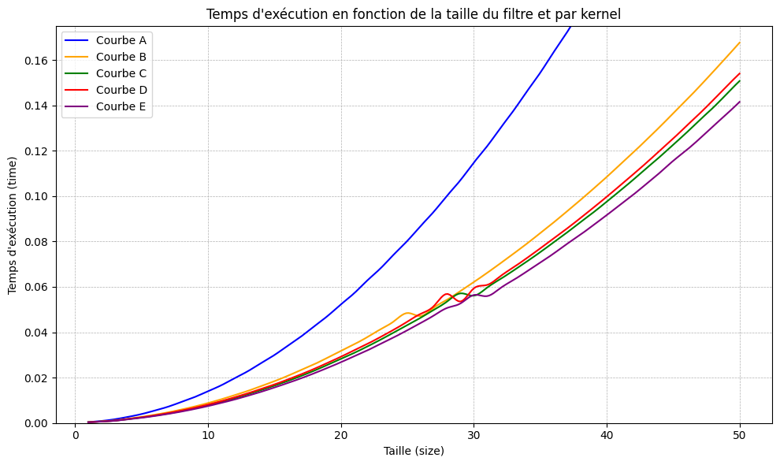

Travail réalisé dans le cadre de l'UP Programmation Parallèle sur GPU de la Toolbox Calcul Haute Performance.

Le dossier "calculs" contient la parallélisation GPU des opérations : Saxpy, Somme matricielle et Produit Matriciel (code en .c et kernel en .cl). Il contient également leurs équivalents OpenMP et CPU ainsi qu'un programme python permettant de visualiser les performances de chacun.

Le dossier "image" contient la parallélisation GPU des opérations de traitement d'image suivantes : Filtre Moyenneur et Filtre Gaussien. Il contient les kernels (.cl), les codes en C++ ainsi que des codes python pour visualiser les performances.

  
  

---

  

